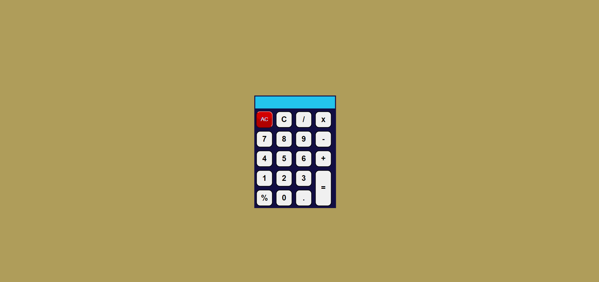

# JavaScript Project - Simple Calculator App

## **Project: Calculator**

### Concepts learned from this project:
- Created a Simple calculator with all calculation functionality and clearing functionality.
- It calculates and returns answers based on eval()

**Live Link :** [Deployed Link](https://js-project-simplecalculator.netlify.app/)
>### Preview :

